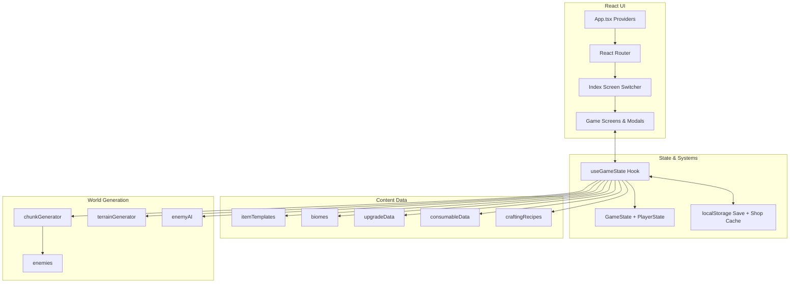

# Junk Runner Technical Architecture

## Overview
Junk Runner is a single-page React game built with Vite and TypeScript. The UI is composed of screen-level components (base, junkyard, shop, etc.) that are orchestrated by a top-level route and screen switcher. A custom `useGameState` hook owns the runtime state, persistence, and most game-system logic (world generation, inventory, upgrades, automation, etc.). The game state is stored in `localStorage`, allowing the session to survive page refreshes.

## System Diagram (Runtime)

## Architecture Layers
1. **Presentation**: Screen-level components (`Base`, `Junkyard`, `Shop`, etc.) render the current view and invoke callbacks for user actions.
2. **State + Systems**: `useGameState` owns `GameState` and implements gameplay operations (movement, loot, upgrades, crafting, automation, persistence).
3. **Content Data**: Static data modules define items, biomes, upgrades, recipes, enemies, and consumables.
4. **World Simulation**: Chunk-based generation, enemy AI, and terrain rules implement exploration logic.

## UI Composition
- `App.tsx` sets up global providers (error boundary, query client, tooltips, toasts) and routes. The root route renders `Index`, while an explicit not-found route handles unmatched URLs.
- `Index` controls screen routing via local component state (`base`, `junkyard`, `cleaning`, `shop`, `upgrades`, `workshop`, `automation`, `scavenge`) and conditionally renders the corresponding screen component. Inventory and stash are handled as modals on top of the current screen.

## State Management & Persistence
- `useGameState` owns the canonical `GameState`, derived runtime bag state, and transient UI-related values (found items, terrain notifications).
- The hook initializes game state by reading a serialized save payload from `localStorage` and performs migration/validation for older saves.
- A save effect serializes state back to `localStorage` (including chunk data for the infinite junkyard) whenever state changes.
- Shop inventory is cached separately in `localStorage` with a refresh timer to avoid regenerating every session.

### Persistence Keys
- `junkrunner_save`: serialized `GameState` plus bag contents.
- `junkrunner_shop`: shop inventory and next refresh timestamp.
- `junkrunner_intro_seen`: flag to skip the terminal intro.

### Key State Shapes
- `GameState`: player state, active junkyard (legacy or infinite), junkyard seed, turn count.
- `PlayerState`: currency, stash, helper robots, cleaning jobs, position, current charge, base upgrades, automation.
- `InfiniteJunkyard`: chunk map (serialized to object for persistence).

## World Generation & Exploration
- The junkyard is generated in two forms: a legacy fixed-size yard and an infinite chunk-based yard.
- The chunk generator uses a deterministic seed per chunk (derived from the base seed plus chunk coordinates) and scales rarity and hazard density by distance from the entrance.
- Terrain hazards, barriers, walls, and loot piles are generated based on biome definitions.
- Enemy AI routines process enemy turns, adjacency effects, and status effects, integrating with movement and turn progression.

## Economy, Crafting, and Progression Systems
- Items are defined from templates, with rarity weights and per-item metadata (capacity, storage dimensions, movement types, etc.).
- Player progression is driven by base upgrades (cleaning slots, workshop tier, control capacity, recharge rates, shop prices) and helper robot frames/components.
- Crafting and workshop systems use recipes and helper frame slots to install and remove modules, repair items, and build new frames.
- Cleaning jobs are time-based (real-time duration) and can be automated by a cleaning bot that queues and collects work.

## Gameplay Operations (Hook Responsibilities)
- **Movement + Turn Flow**: Moves the player, handles battery drain, reveals tiles, and triggers enemy turns.
- **Looting**: Generates pile loot using chunk-aware seeds and rarity weighting.
- **Inventory**: Calculates bag capacity, manages stash transfers, and applies weight/size constraints.
- **Shop**: Periodically refreshes inventory and applies price modifiers.
- **Automation**: Runs a timed cleaning bot loop that queues and collects jobs.

## Key Runtime Flow
1. App initializes providers and routes to `Index`.
2. `Index` uses `useGameState` to load or create a save and then renders the current screen.
3. When the player enters the junkyard, the hook either creates or loads a chunk-based world, updates the player position, and reveals tiles.
4. Movement, searches, and combat update the `GameState`, triggering persistence and UI refresh.
5. Returning to base unlocks shop, upgrades, workshop, and cleaning flows, as well as passive recharge.
